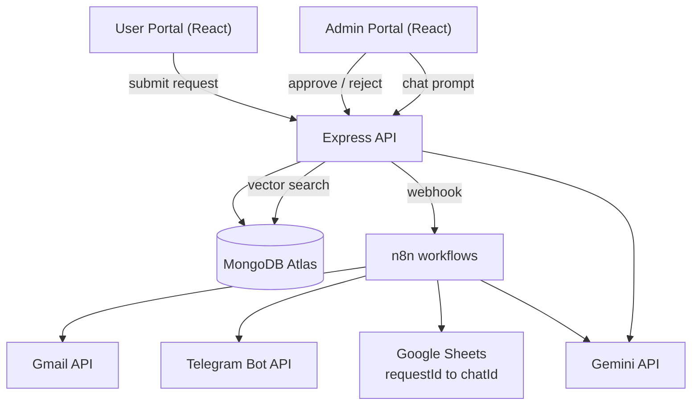
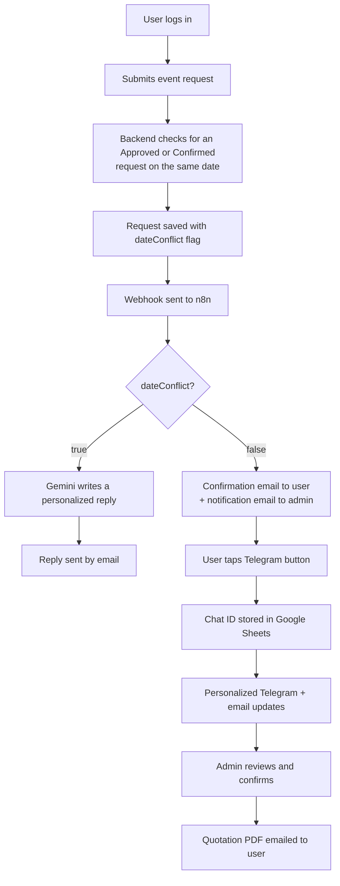
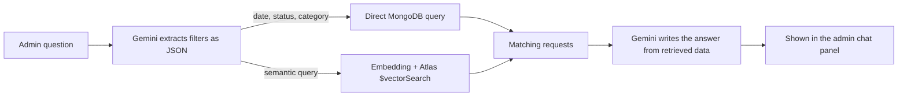

# Event Management Automation Platform

A full-stack event request platform with automated multi-channel notifications and an AI-powered admin assistant. Customers submit and track event requests in a **User Portal**; the business reviews, confirms and searches requests in an **Admin Portal**. Everything in between (confirmation emails, Telegram updates, date-conflict replies, quotation delivery) runs automatically through **n8n** workflows and the **Gemini API**.

 

---

## Table of Contents

- [Features](#features)
- [System Architecture](#system-architecture)
- [How It Works](#how-it-works)
- [Tech Stack](#tech-stack)
- [Data Model](#data-model)
- [Getting Started](#getting-started)
- [n8n Setup](#n8n-setup)
- [AI Chat Panel Setup](#ai-chat-panel-setup)
- [Design Decisions](#design-decisions)
- [Known Limitations](#known-limitations)
- [Roadmap](#roadmap)
- [Author](#author)

---

## Features

**User Portal**
- JWT-authenticated signup and login
- Submit event requests (title, description, category, event date)
- Track request status in real time (Pending, Approved, Rejected, Confirmed, Date Conflict)
- Opt in to Telegram updates with one click from the confirmation email

**Automation (n8n)**
- Confirmation email to the customer and notification email to the admin on every new request
- Per-user Telegram opt-in: the customer's chat ID is captured and stored against their request, so updates only ever reach the right person
- Status-change notifications by email, plus Telegram when the user has opted in
- Quotation PDF attached and emailed automatically when the admin confirms a request

**AI (Gemini)**
- **Date-conflict handling:** when the requested date is already booked, Gemini writes a personalized, polite reply asking for alternative dates instead of sending a generic template
- **Admin AI Chat Panel:** ask questions in plain language (for example, "who booked on 29th Sep" or "show me large weddings") and get an answer grounded in real request data

**Admin Portal**
- Review, approve or reject requests
- Approval triggers the notification and quotation workflow
- Built-in AI chat panel for searching request data

---

## System Architecture



The Express backend owns the business rules (authentication, request storage, date-conflict detection). n8n owns everything that happens *in reaction to* an event: sending the right message, on the right channel, to the right person.

---

## How It Works

### End-to-end flow



### n8n workflows

| Workflow | Trigger | What it does |
|---|---|---|
| **1. New Request** | Webhook from backend | Branches on `dateConflict`. No conflict: emails the customer (with a Telegram opt-in button) and the admin. Conflict: Gemini generates a personalized message, a Code node formats it as HTML, and it is emailed to the customer. |
| **2. Telegram Opt-in** | Telegram Trigger (`/start <requestId>`) | Extracts `chatId` and `requestId`, appends a row to Google Sheets, and replies "You're connected". |
| **3. Status Update and Quotation** | Webhook on admin status change | Emails the customer (quotation PDF attached on approval). Looks up the `chatId` in Google Sheets by `requestId` and sends a Telegram message if the user has opted in. |

Each workflow has its own trigger because the three events happen at unrelated times: a form submit, a Telegram tap, and an admin action. Keeping them separate makes each one easy to test and debug independently.

### Date-conflict detection

On every new request the backend looks for an existing request on the same calendar date with status `Approved` or `Confirmed`. The new request is always saved (so nothing is lost) with `dateConflict: true` and status `Date Conflict`, and the flag is included in the webhook payload. n8n branches on that flag; the backend does not need to know anything about email or AI.

### AI Chat Panel (hybrid retrieval)

Admin questions fall into two types that need different handling:

- **Exact questions** ("who booked on 29th Sep", "all pending weddings"): vector search is unreliable for precise values like dates, so these go to a direct MongoDB query.
- **Conceptual questions** ("large corporate events with catering"): these use semantic search over stored embeddings.



---

## Tech Stack

| Layer | Technology |
|---|---|
| Frontend | React, Tailwind CSS |
| Backend | Node.js, Express |
| Database | MongoDB Atlas, Mongoose |
| Auth | JWT |
| Automation | n8n |
| Email | Gmail API |
| Messaging | Telegram Bot API |
| Opt-in store | Google Sheets API |
| AI | Google Gemini API (generation and embeddings) |
| Semantic search | MongoDB Atlas Vector Search |
| Hosting | AWS |

---

## Data Model

**Request**

| Field | Description |
|---|---|
| `requestId` | Human-readable unique ID, format `REQ-YYYYMMDD-XXXX` |
| `userId` | Reference to the submitting user |
| `title`, `description`, `category` | Event details |
| `eventDate` | Requested date |
| `status` | `Pending`, `Approved`, `Rejected`, `Confirmed`, `Date Conflict` |
| `dateConflict` | `true` if the date overlapped an approved booking |
| `embedding` | Vector embedding of title + description, used by the chat panel |

Customer name, email and phone live on the **User** model and are looked up through `userId` when a webhook payload is built.

**Telegram Subscribers (Google Sheet)**

| Column | Description |
|---|---|
| `requestId` | Links the subscription to one request |
| `chatId` | Telegram chat ID captured on opt-in |
| `firstName`, `connectedAt` | Metadata |

---

## Getting Started

### Prerequisites

- Node.js 18+
- A MongoDB Atlas cluster
- An n8n instance (cloud or self-hosted)
- A Telegram bot (create one with [@BotFather](https://t.me/BotFather))
- A Google account with Gmail and Google Sheets access
- A Gemini API key from [Google AI Studio](https://aistudio.google.com/)

### Installation

```bash
git clone https://github.com/sathiswarj/<repo-name>.git
cd <repo-name>

# backend
cd server
npm install

# frontend (repeat for each portal)
cd ../client
npm install
```

### Environment variables

Create a `.env` file in the backend folder:

```env
NODE_ENV=development
PORT=5000
JWT_SECRET=your_jwt_secret
MONGO_URI=your_mongodb_connection_string

# n8n webhooks (production URLs from your webhook nodes)
N8N_WEBHOOK_URL=https://your-n8n-instance/webhook/new-request
N8N_STATUS_WEBHOOK_URL=https://your-n8n-instance/webhook/status-update

# AI chat panel
GEMINI_API_KEY=your_gemini_api_key
```

> Never commit `.env`. Bot tokens and API keys belong in your `.env` file and in n8n's credential store, not in the repository.

### Run

```bash
# backend
npm run dev

# frontend
npm run dev
```

---

## n8n Setup

1. **Import the workflows** from the `n8n/` folder (export your workflows as JSON and remove credentials before committing).
2. **Create credentials** inside n8n for Gmail (OAuth), Telegram (bot token), Google Sheets (OAuth), and the Gemini API key.
3. **Create the Google Sheet** `Telegram Subscribers` with these headers in separate cells of row 1: `requestId`, `chatId`, `firstName`, `connectedAt`.
4. **Copy the production webhook URLs** from the two Webhook nodes into your backend `.env`.
5. **Activate all workflows.** Production webhook URLs only respond while a workflow is active.
6. In the confirmation email, the Telegram button links to `https://t.me/<your_bot_username>?start=<requestId>`.

---

## AI Chat Panel Setup

1. Add an `embedding` field (array of numbers) to the Request schema. Embeddings are generated when a request is created; run the migration script once to backfill existing requests.
2. Create a **Vector Search index** on the `embedding` field in MongoDB Atlas. Set `numDimensions` to match your embedding model's output size:

```json
{
  "fields": [
    {
      "type": "vector",
      "path": "embedding",
      "numDimensions": 768,
      "similarity": "cosine"
    }
  ]
}
```

3. Set `GEMINI_API_KEY` in the backend `.env`.

---

## Design Decisions

- **Conflict detection lives in the backend, not n8n.** The rule for what counts as a conflict sits next to the data it queries, and n8n stays focused on communication.
- **One workflow per trigger.** Form submits, Telegram opt-ins and admin actions are unrelated events, so each has its own workflow.
- **Per-request Telegram mapping.** Every Telegram message is sent by looking up the `chatId` for a specific `requestId`, never broadcast, so one customer cannot see another's updates.
- **Hybrid retrieval for the chat panel.** Exact filters go to MongoDB; only genuinely conceptual questions use vector search.
- **Requests are always saved, even on conflict.** The conflict flag drives the notification path without losing the customer's submission.

---

## Known Limitations

- **Google Sheets as the subscriber store** is a lightweight choice for a prototype. In production this mapping would move into MongoDB.
- **Telegram requires opt-in.** A bot cannot message a user until they start a conversation, so email remains the guaranteed channel.
- **Gemini free tier is rate-limited.** Fine for development and low volume; a paid tier is advisable for heavier use.
- **The conflict check compares calendar dates only**, not time slots, so two events on the same day at different times are treated as a conflict.

---

## Roadmap

- Accept / reject / negotiate flow for quotations, with a message thread visible to both sides
- Per-request dynamic PDF quotations
- Persistent chat history in the admin panel
- Automated tests for the conflict-detection logic
- Time-slot-aware conflict checks

---

## Screenshots

<!-- Add screenshots here -->

| User Portal | Admin Portal |
|---|---|
|  |  |

| n8n Workflows | AI Chat Panel |
|---|---|
|  |  |

---

## Author

**Sathiswar J**
Full Stack Software Engineer

- GitHub: [github.com/sathiswarj](https://github.com/sathiswarj)
- LinkedIn: [linkedin.com/in/sathiswar-j](https://linkedin.com/in/sathiswar-j)
